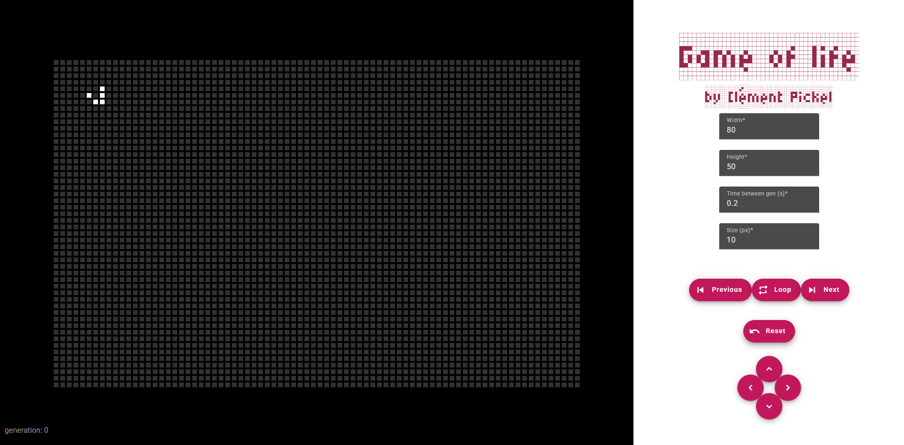

# Game of Life Angular

Ce projet est une implémentation du célèbre jeu de la vie de Conway, réalisée avec [Angular CLI](https://github.com/angular/angular-cli) version 17.0.7.

## Result



## Get started

1. Clonez le dépôt :

   ```bash
   git clone https://github.com/clementpickel/GOL_angular.git
   ```

2. Accédez au répertoire du projet :

   ```bash
   cd GOL_angular
   ```

3. Installez les dépendances :

   ```bash
   npm install
   ```

4. Démarrez le serveur de développement :

   ```bash
   ng serve
   ```

5. Ouvrez votre navigateur et accédez à `http://localhost:4200/` pour voir l'application en action.

## Fonctionnalités

- **Initialisation**: Configurez une grille de cellules vivantes et mortes.
- **Simulation**: Avancez la simulation selon les règles du jeu de la vie de Conway.
- **Contrôle**: Mettez en pause, reprenez et réinitialisez la simulation.
- **Personnalisation**: Modifiez la taille de la grille et la vitesse de la simulation.

## Contribution

Les contributions sont les bienvenues! Veuillez soumettre une pull request ou ouvrir une issue pour discuter des changements que vous souhaitez apporter.

## Licence

Ce projet est sous licence MIT. Voir le fichier [LICENSE](LICENSE) pour plus de détails.

## Serveur de développement

Exécutez `ng serve` pour démarrer un serveur de développement. Naviguez vers `http://localhost:4200/`. L'application se rechargera automatiquement si vous modifiez l'un des fichiers sources.

## Génération de code

Exécutez `ng generate component component-name` pour générer un nouveau composant. Vous pouvez également utiliser `ng generate directive|pipe|service|class|guard|interface|enum|module`.

## Construction

Exécutez `ng build` pour construire le projet. Les artefacts de construction seront stockés dans le répertoire `dist/`.

## Exécution des tests unitaires

Exécutez `ng test` pour exécuter les tests unitaires via [Karma](https://karma-runner.github.io).

## Exécution des tests de bout en bout

Exécutez `ng e2e` pour exécuter les tests de bout en bout via une plateforme de votre choix. Pour utiliser cette commande, vous devez d'abord ajouter un package qui implémente des capacités de test de bout en bout.
